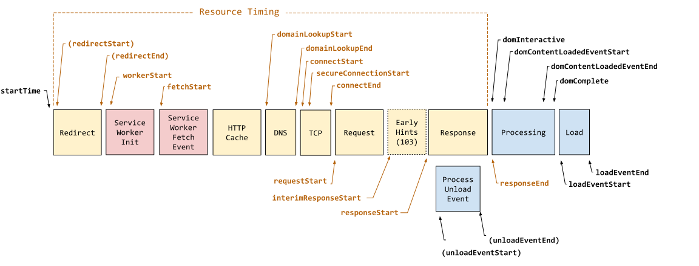
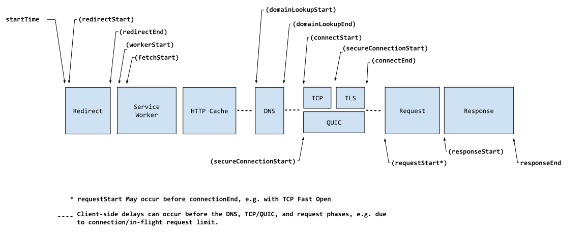

내비게이션과 리소스 타이밍에 대해 알아보고, 측정해보겠습니다.

## Navigation and resource timings

Navigation timings (탐색 타이밍)

- 브라우저의 문서 탐색 이벤트를 측정하는 지표

Resource timings (리소스 타이밍)

- 애플리케이션의 리소스 로딩과 관련된 세부적인 네트워크 타이밍 측정값

공통점과 차이점

- 둘 다 동일한 읽기 전용 속성을 제공
- 탐색 타이밍: 기본 문서의 타이밍을 측정
- 리소스 타이밍: 해당 기본 문서에서 호출한 모든 애셋 또는 리소스 및 요청된 리소스에 대한 시간 제공

### PerformanceNavigationTiming



### PerformanceResourceTiming



아래 일반적인 performance timings는 더이상 사용되지 않지만 모든 브라우저에서 지원됨

## Performance timings

performanceNavigationTiming API로 대체됨

performance timing API는 페이지 로딩 프로세스의 각 지점에 도달한 시간을 ms 단위의 읽기 전용 시간으로 제공

navigationStart, unloadEventStart, unloadEventEnd, redirectStart, redirectEnd, fetchStart, domainLookupStart, domainLookupEnd, connectStart, connectEnd, secureConnectionStart, requestStart, responseStart, responseEnd, domLoading, domInteractive, domContentLoadedEventStart, domContentLoadedEventEnd, domComplete, loadEventStart, loadEventEnd.

위 순서대로 진행

## Performance Entry API

탐색(navigation) 및 리소스 로딩 프로세스에서 시간을 표시하고 측정할 수 있음

```javascript
performance.getEntriesByType("navigation").forEach((navigation) => {
  console.dir(navigation);
});

performance.getEntriesByType("resource").forEach((resource) => {
  console.dir(resource);
});
```

## Navigation Timing

1. 사용자가 웹사이트나 애플리케이션을 요청
2. 브라우저를 채우기 위해 사용자 에이전트는 실제 요청을 함
3. 서버가 요청된 자산을 반환하기 전에 DNS 조회, TCP 핸드셰이크, TLS 협상 등 일련의 단계를 거침
4. 그런 다음 브라우저는 수신된 콘텐츠를 구문 분석하고 DOM, CSSOM, 접근성(accessibility) 및 렌더 트리를 구축하여 최종적으로 페이지를 렌더링
5. 사용자 에이전트가 문서 구문 분석을 중지하면, 사용자 에이전트는 문서 준비 상태(readiness)를 interactive로 설정함
6. 구문 분석이 필요한 deferred 스크립트가 있는 경우 구문 분석을 수행한 다음 `DOMContentLoaded`를 실행하고 그 후에 준비가 완료되도록 설정함
7. 이제 문서가 로드 후 작업(post-load tasks)을 처리할 수 있으며, 그 이후에는 문서가 완전히 로드된 것으로 표시됨

```javascript
// navigation 타입에 대한 PerformanceEntry 객체 배열을 반환
const navigationTimings = performance.getEntriesByType("navigation");
// 0번째로 가져올 수 있음
const timing = performance.getEntriesByType("navigation")[0];
```

### 프로토콜

```javascript
const protocol = timing.nextHopProtocol;
```

- 리소스를 가져오는 데 사용된 네트워크 프로토콜을 반환
- `http/2`의 경우 `h2`

### 압축

```javascript
const compressionSavings = 1 - timing.transferSize / timing.decodedBodySize;

const compressionSavings = 1 - timing.encodedBodySize / timing.decodedBodySize;
```

- `transferSize`를 `decodedBodySize`로 나눈 다음 100%에서 빼서 압축 절감 비율을 구함
- `transferSize`를 사용하면 오버헤드 바이트를 포함
- 모든 리소스를 합친 것이 아니라 이 단일 문서에 대한 크기임
- DOMContentLoaded 이벤트가 종료된 시점과 DOM이 완료된 시점 사이의 기간과 시간도 확인해야 함

### 요청 시간

```javascript
const request = timing.responseStart - timing.requestStart;
```

- 응답 시간: 응답 시작 시간 - 요청 시작 시간

요청 시작

- 사용자 에이전트가 서버, 관련 애플리케이션 캐시 또는 로컬 리소스에서 리소스 요청을 시작하기 직전의 순간

응답 시작

- 사용자 에이전트의 HTTP 파서가 관련 애플리케이션 캐시, 로컬 리소스 또는 서버로부터 응답의 첫 바이트를 수신한 직후의 시간
- 요청이 수신되어 처리된 후에 발생

### load 이벤트 duration

```javascript
// load 이벤트의 지속 시간 =
// (현재 문서의 load 이벤트가 완료된 시간) - (현재 문서의 load 이벤트가 실행되기 직전의 시간)
const load = timing.loadEventEnd - timing.loadEventStart;
```

### DOMContentLoaded 이벤트

```javascript
// DOMContentLoaded 이벤트 지속 시간 =
// 이벤트가 완료된 직후의 시간 - 사용자 에이전트가 DOMContentLoaded 이벤트를 실행하기 직전의 시간
const DOMContentLoaded =
  timing.domContentLoadedEventEnd - timing.domContentLoadedEventStart;
```

- 이를 50ms 이상으로 유지하면 반응형 사용자 인터페이스를 보장하는 데 도움이 됨

### Duration

- `PerformanceNavigationTiming.loadEventEnd`와 `PerformanceEntry.startTime`의 차이

## Resource timing

Navigation timing

- 일반적으로 다른 모든 자산이 요청되는 HTML 파일인 메인 페이지의 성능을 측정

Resource timing

- 개별 리소스, 메인 페이지에서 호출되는 자산 및 해당 리소스가 요청하는 모든 자산의 타이밍을 측정
- DNS 조회, TCP 핸드셰이크, 보안 연결 시작은 도메인당 한 번씩 수행됨

```
startTime
redirectStart
                              Redirect
redirectEnd

fetchStart
                              App Cache

domainLookupStart
                              DNS
domainLookupEnd

connectStart
secureConnectionStart         TCP
connectEnd

requestStart
                              Request

responseStart
                              Response
responseEnd
```

## 참고

[Navigation and resource timings](https://developer.mozilla.org/en-US/docs/Web/Performance/Navigation_and_resource_timings)

[PerformanceNavigationTiming](https://developer.mozilla.org/en-US/docs/Web/API/PerformanceNavigationTiming)

[PerformanceResourceTiming](https://developer.mozilla.org/en-US/docs/Web/API/PerformanceResourceTiming)

[PerformancePaintTiming](https://developer.mozilla.org/en-US/docs/Web/API/PerformancePaintTiming)
